# Dominate AI search with real time analysis

Gain insights & improve visibility on ChatGPT, AI Overview, Perplexity and many other LLMs

[Book a Demo](https://calendly.com/isha-visble/30min-1?month=2025-06) 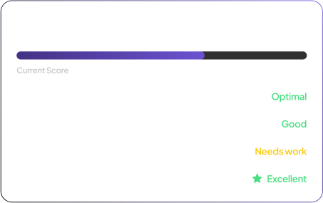 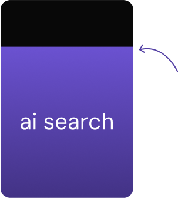

## 79% of consumers are expected to shift to AI search within next year

SEJ Report 

## More than 50% of brands visible in AI search responses don’t belong in top-ranking results on Google

Independent research by Visble [click on this tab for next](#) 

## Traditional search volumes will drop by 25% by 2025, with organic search traffic expected to decrease by over 50%

Gartner, February, 2024

## Get your brand visible on:

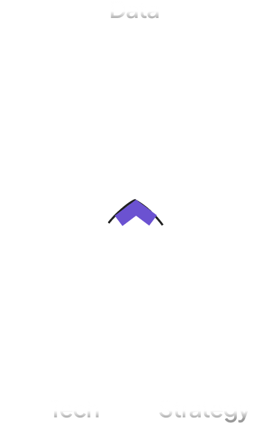

## We build AEO Strategies using Large Scale Experiments

[See Our Generative Engine Optimzation Playbook](https://visble.ai/blog/generative-engine-optimization-playbook/)

## Influence AI Searches in few simple steps

Instead of spending all your time with your nose buried in SEO tools:

 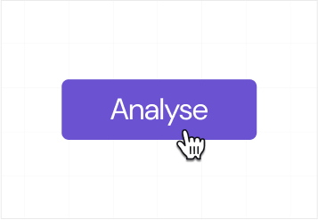

### Analyse response reasoning

Our proprietary tech reads the responses after searching your brand

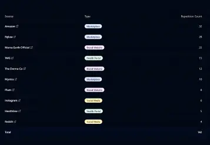

### Discover sources for AI

You understand where the the AI tool is sourcing its data from

  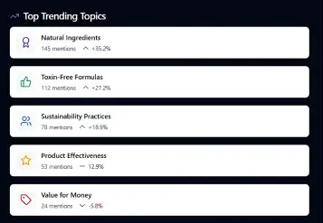

### Publish right content to be visible

We give you exactly what to publish, where to publish, so you top the results

## Track. Measure. Optimise

Turn AEO Efforts into Actionable Results

- Generate top user queries
- Explore AI’s key content patterns
- Monitor your Visibility Score
- Compare Key metrics with Competitors
- See factors used by AI to Answer prompt
- Strategy Recommendation
- Track results

[Track metrics for my brand](#) 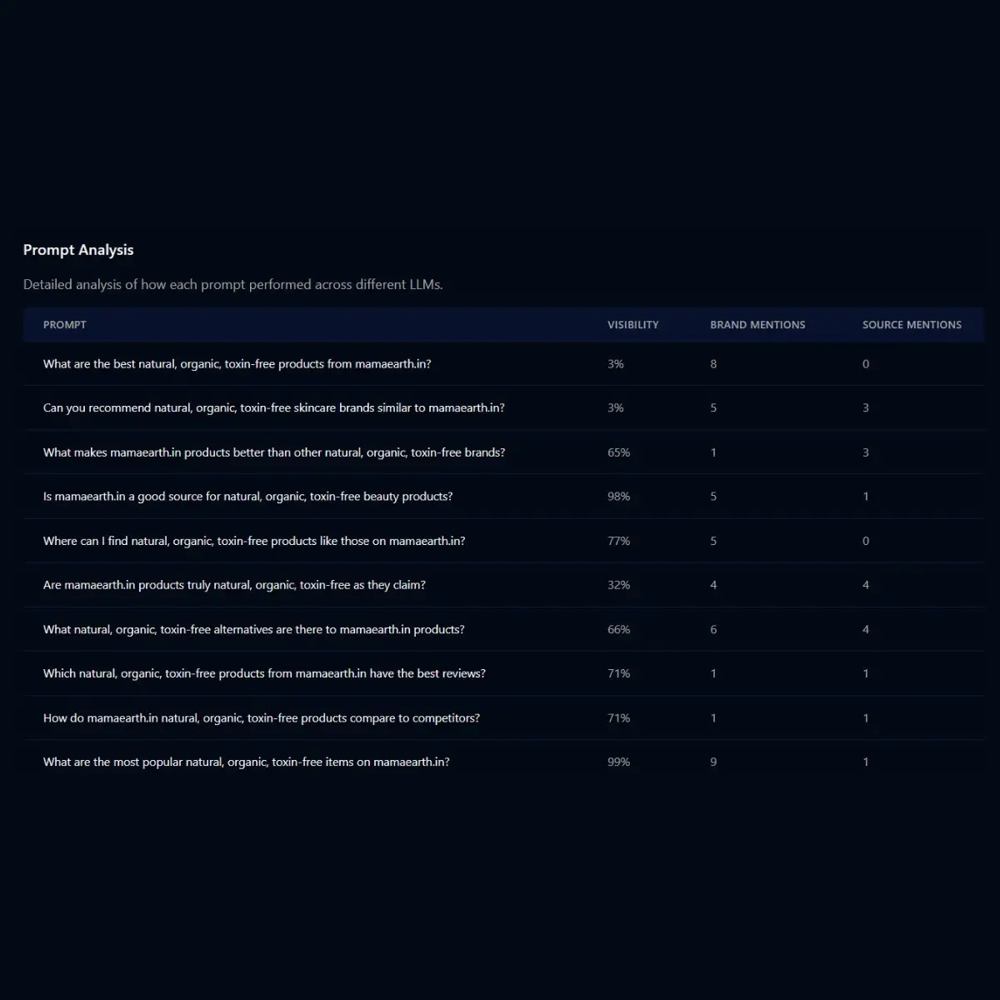 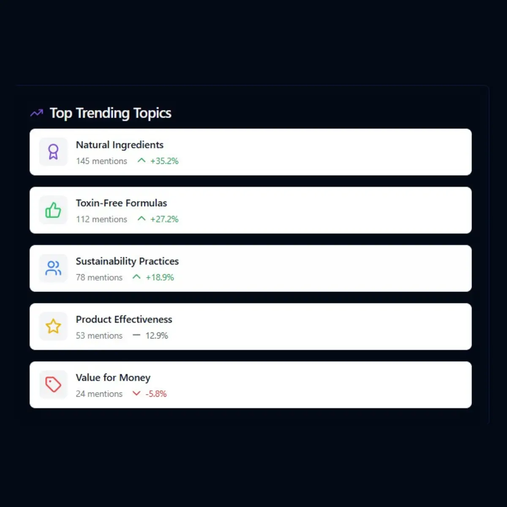 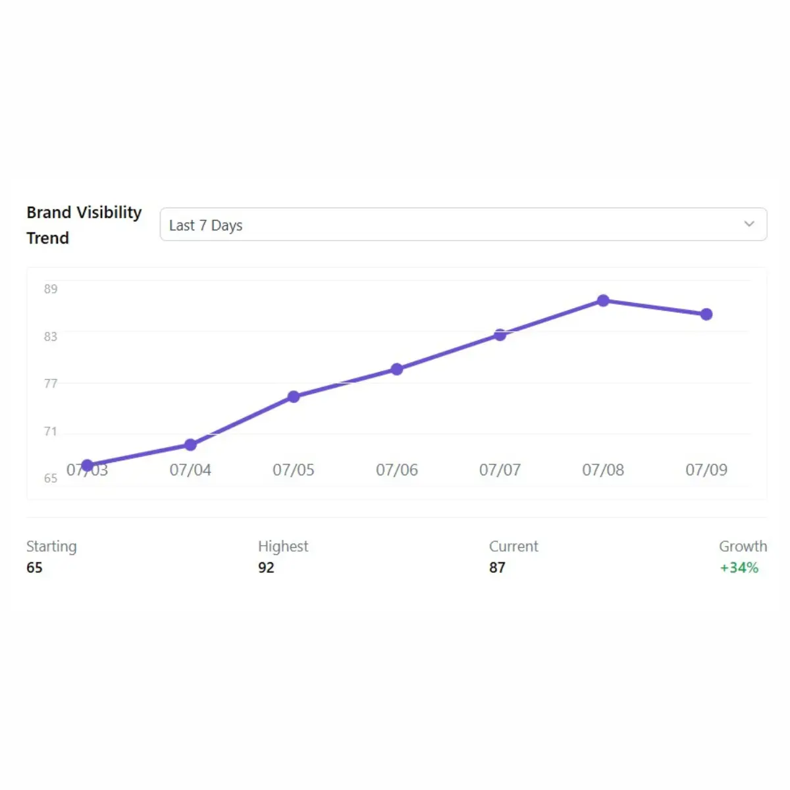 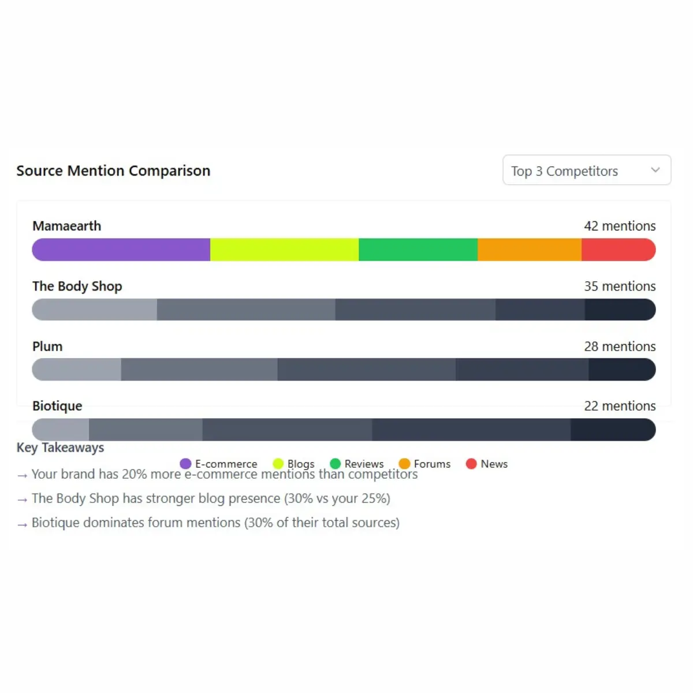 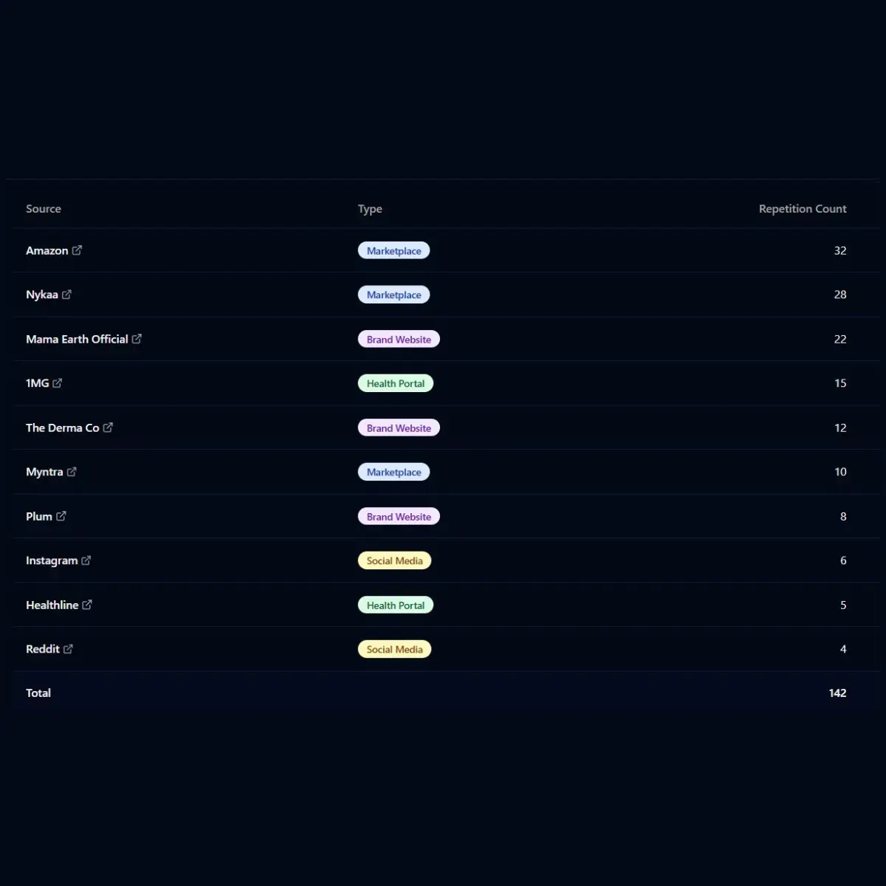 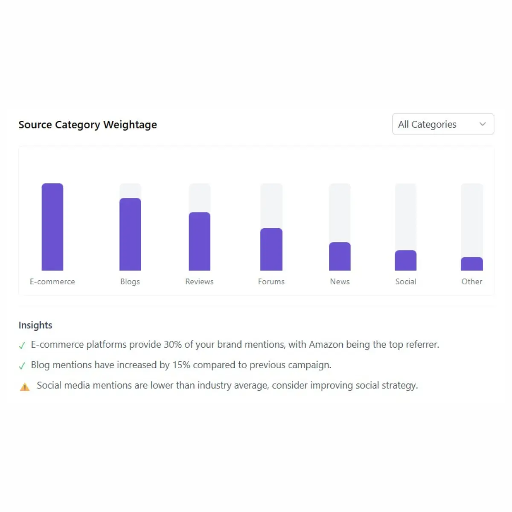 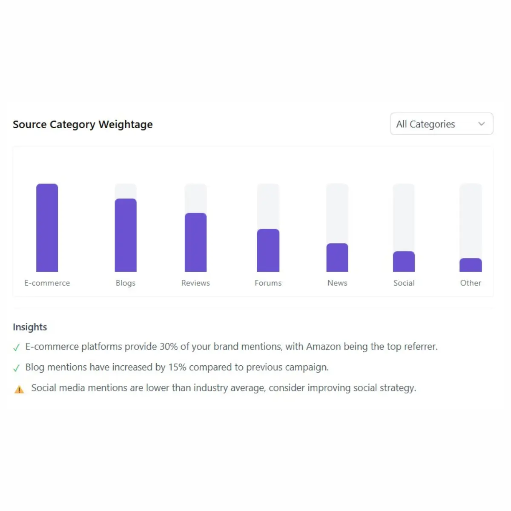

## Be an Early Adopter  

Save more than 50% Cost  Get 20% more Visibility

[Get your AEO report](https://app.visble.ai/signup)  

## Pricing

Choose the plan that fits your needs

### $29

## Starter

- Includes 50 prompts
- 2 Campaigns
- 1 Domain
- Single Country
- (Users can access this for free for 14 days)

[Choose Plan](https://app.visble.ai/signup)

## Business

### $249

- Includes 1500 prompts
- Unlimited Campaigns
- Upto 10 Domains
- Top up prompts
- Access upto 5 countries

[Choose Plan](https://app.visble.ai/signup)

## Enterprise

### Custom

- Includes 3000 prompts
- Unlimited Campaigns
- Upto 10 Domains
- Top up prompts
- Access upto 5 countries

[Contact Sales](https://calendly.com/isha-visble/30min-1?month=2025-06)
