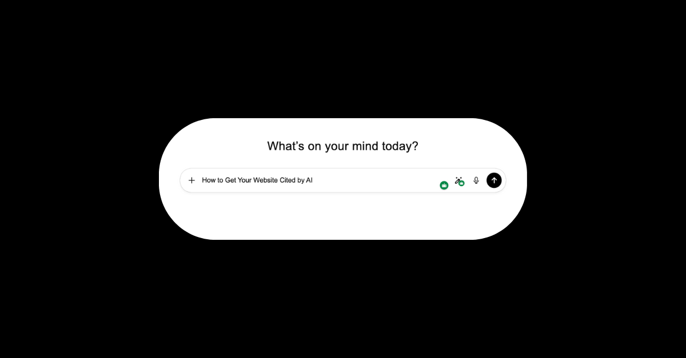
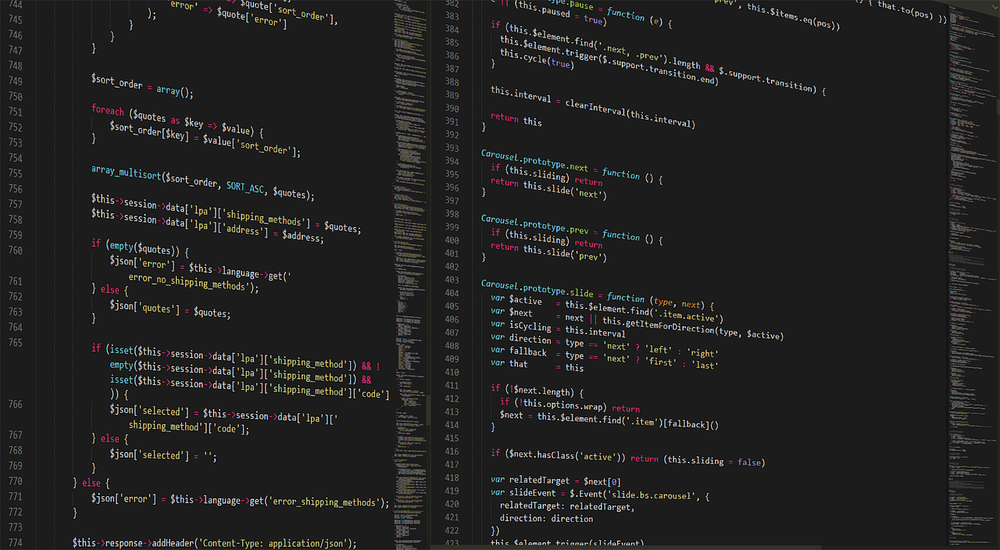
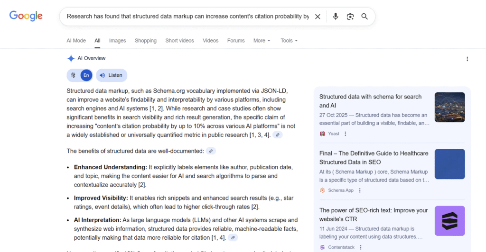
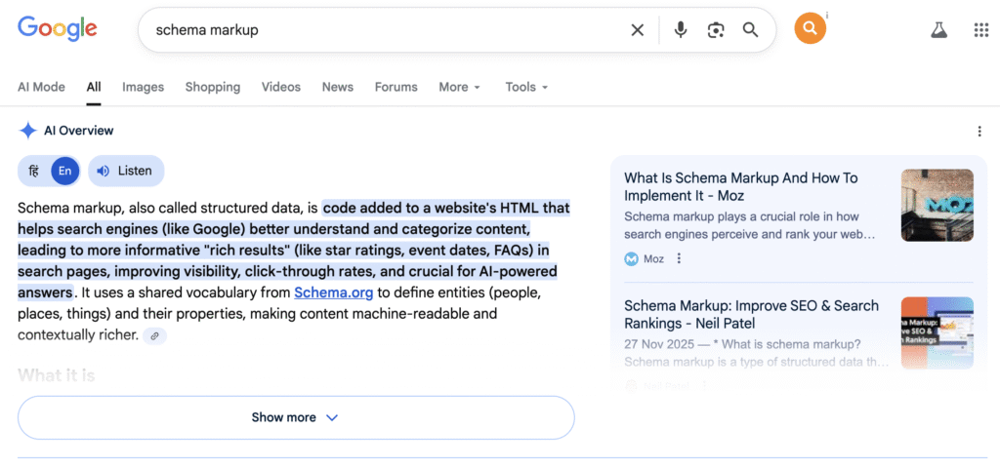
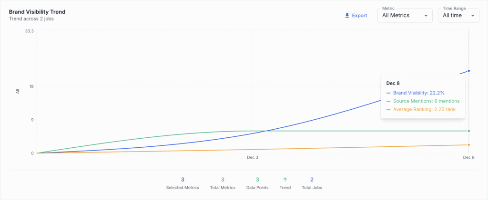
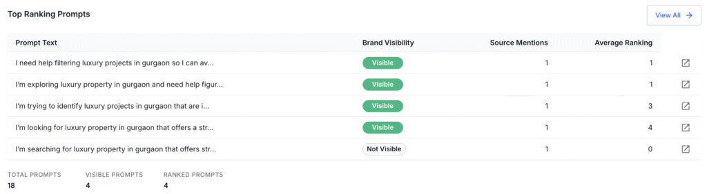
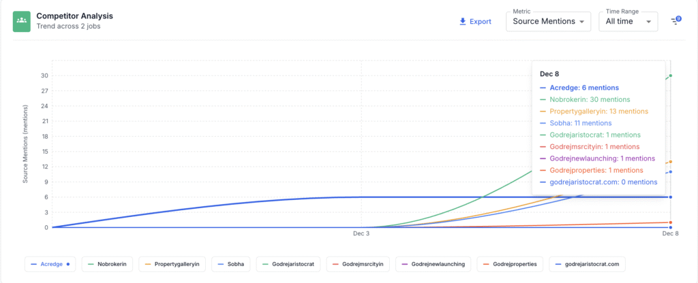

# How to Get Your Website Cited by AI

###### Isha Sachdeva

Founder, visble.ai

Between May 2024 and May 2025, overall [web crawl traffic](https://blog.cloudflare.com/from-googlebot-to-gptbot-whos-crawling-your-site-in-2025/?utm_source=chatgpt.com/) (from search engines + AI bots) grew by 18%, while AI-only crawlers have surged, with one major crawler boosting its share from 5% to 30% approximately.

In parallel, a 2025 [empirical audit of 1,702 citations](https://arxiv.org/abs/2509.10762?utm_source=chatgpt.com) across AI answer engines found that pages with structured data, semantic HTML, and metadata were consistently more likely to be selected as sources.

But many of those crawls never result in user visits. Some sites report nearly [900 bot crawls for every single human referral](https://blog.cloudflare.com/crawlers-click-ai-bots-training/#:~:text=Over%20the%20same%20period%2C%20search,drives%20users%20to%20a%20website.). So, being crawled is not enough. To get your website noticed and cited by AI, your content must be structured, quotable, and authoritative.

That’s where Generative Engine Optimisation (GEO) steps in. Now it’s no longer enough to simply publish and hope for clicks. Your focus must be to excel in Crawlability, Quotability, and Authority. That’s what AI search engines reward.

## Technical Accessibility (Ensuring AI Can Read You)

The first step in GEO is ensuring the AI’s "eyes", the LLM-specific crawlers like GPTBot or OAI-Searchbot, can actually access and process your content. Even the highest-quality content is invisible if the bot is blocked.

### **1\. Check Your Host/CDN for AI Blocks**

Many popular Content Delivery Networks (CDNs), such as Cloudflare, or certain web hosting providers, have blanket security settings. This automatically blocks known AI crawlers to manage bandwidth or prevent scraping.

- **Action:** Contact your hosting provider or review your CDN security settings immediately. Verify that specific AI user agents (e.g., GPTBot, OAI-Searchbot, or newer LLM-specific crawlers) are explicitly allowed access to your website.

### **2\. Configure Your robots.txt Explicitly**

Don't rely on implicit rules. While you may want to restrict general crawlers from low-value pages (like login screens), you must proactively grant access to your authoritative content for AI models.

- **Action:** Allow specific AI agents to crawl your most valuable sections in your robots.txt file. Example Snippet: User-agent: GPTBot Allow: /blog/ Allow: /research/

### **3\. Reduce JavaScript-Only Content**

The Problem: While Googlebot is highly capable of executing client-side JavaScript (JS), many AI crawlers and LLM data pipelines are not. Content rendered dynamically via JS often appears to them as an empty or incomplete page.

- **Action:** Prioritise static HTML rendering for all key informational elements; headings, lists, definitions, and core data points. If a fact is important enough to be cited, it must be visible without executing client-side code.

## Content Quotability (Making Your Facts Irresistible)

Once the AI can see your site, the next step is to [make your content highly extractable.](https://www.averi.ai/blog/how-to-create-content-that-actually-surfaces-in-llm-search-in-2025) It should be a quotable source material that the LLM prefers to reference over your competitors.

### **4\. The E-E-A-T Foundation: Build Trust for the AI**

AI models look for trusted and reliable sources. A fact from a high-E-E-A-T source is what LLMs value.

- **Expert Credentials:** Ensure every cited piece has a clear Author Bio with verifiable experience and expertise (the E's in E-E-A-T). Add a link to the author’s profile (LinkedIn, academic journal, professional organisation).
- **Internal Citations:** Actively cite and interlink authoritative, third-party sources (research papers, government data, industry reports) within your text. This shows that you have done your homework and anchors your facts in external authority, boosting your page’s credibility score.

### **5\. Format for Instant Extraction: The Direct Answer Rule**

AI does not have time for stories. It needs concise, self-contained answers.

- **Action:** Adopt a journalistic, AI-friendly writing style. Start every major section or question with a concise, direct, 1-2 sentence answer.
    - Bad: "Before we discuss the steps, let's look at the history of schema..."
    - Good: "Schema Markup is machine code that tells search engines exactly what your content means, making it highly valuable for AI citations."

This "answer-first" structure ensures that if the AI extracts only one sentence, it still captures the core fact, making your content a high-probability quote.

### **6\. Publish Original Data & "Metrics Pieces"**

AI prioritises unique, non-duplicative data. If you have the only source for a specific statistic, the AI must cite you to include that data in its summary.

- **Action:** Conduct and publish original research, statistics, case studies, or industry surveys.
    - **Value:** When users prompt, "What are the latest stats on XYZ?" the AI will prefer to cite your unique data over a summary of common knowledge.

**Data Insight:** Studies show that pages containing exclusive metrics and charts have an average of 2.7% higher cite rate in AI overviews compared to informational articles lacking original data.

## Authority Signals (Boosting Your Brand's Trust Score)

This final set of strategies focuses on structural and off-site signals. These are the ones that validate your brand as a trustworthy, well-established entity that search engines rely on.

### **7\. Schema Markup Mastery for Structured Answers**

Schema is the direct line to the AI's processing layer. It tells the machine, "This is a question, and this is the answer," streamlining the synthesis process.

- **Action:** Implement advanced schema types:
    - **HowTo Schema:** Essential for step-by-step guides, making it easy for AI to create numbered instructions.
    - **FAQ Page Schema:** Explicitly label clear question-and-answer pairs, perfect for AI-generated summaries.
    - **Entity Schema:** Use tags like Organisation and Person to connect your brand and authors to established knowledge graphs.

This structuring can give you a significant citation boost. Structured data markup can significantly [increase the content’s citation probability](https://yoast.com/structured-data-schema-ultimate-guide/#:~:text=Structured%20data%20has%20become%20an%20essential%20part,AI%2Ddriven%20features%2C%20rich%20results%2C%20and%20across%20platforms.) across various AI platforms compared to unstructured content.

### **8\. Off-Site Trust: Optimising Brand Mentions**

GEO is not just about your site. It's about your entity across the web. AI models prioritise brands with known, consistent public profiles.

- **Knowledge Panels & Wikipedia:** Ensure your company or key entities have a Wikipedia entry and a verified Google Knowledge Panel. These are core, high-trust signals for LLMs.
- **High-Authority Directories:** Actively secure placement and manage profiles on authoritative, highly-ranked review sites and industry directories. AI frequently synthesises these reviews for product recommendations.

### **9\. Consistent Messaging (Entity Alignment)**

The AI needs to recognise that your website, your social media, and your directory listings all refer to the same authoritative entity.

**Action:** Ensure your brand name, official product names, and core claims are identical across your website, social profiles, and directory listings. Consistency helps the search engines to correctly map all trust signals to a single, authoritative entity.

## How Visble.ai Helps Measure Your AI Success

Optimising for AI citation requires specialised measurement. When doing everything systematically, tracking your progress must also be systematic. That’s what [Visble.ai](http://visble.ai) is built for.

<figure>

<figcaption>

Citation Tracking

</figcaption>

</figure>

Monitor your brand’s Citation Share. See how often you are cited compared to your competitors in AI Overviews and LLM responses.

<figure>

<figcaption>

Prompt Tracking

</figcaption>

</figure>

Identify the exact, long-tail questions and conversational prompts users are asking AI in your niche. Use this data to generate highly relevant, quote-ready content.

Analyse which competitors are winning citations, allowing you to reverse-engineer their E-E-A-T and structure choices.

[Track GEO Metrics Now](https://app.visble.ai/signup)

## Conclusion

Generative Engine Optimisation (GEO) does not put an end to SEO. It's just that now you have to present your brand in a way that it becomes an irreplaceable, authoritative source. By mastering Crawlability, Quotability, and Authority, you transition your brand from being a passive resource to an active source of AI knowledge.

Start measuring your brand's AI visibility today. [Visble.ai](http://visble.ai) provides the essential analytics to ensure your website is not just seen by users, but trusted and cited by the AI that guides them.
