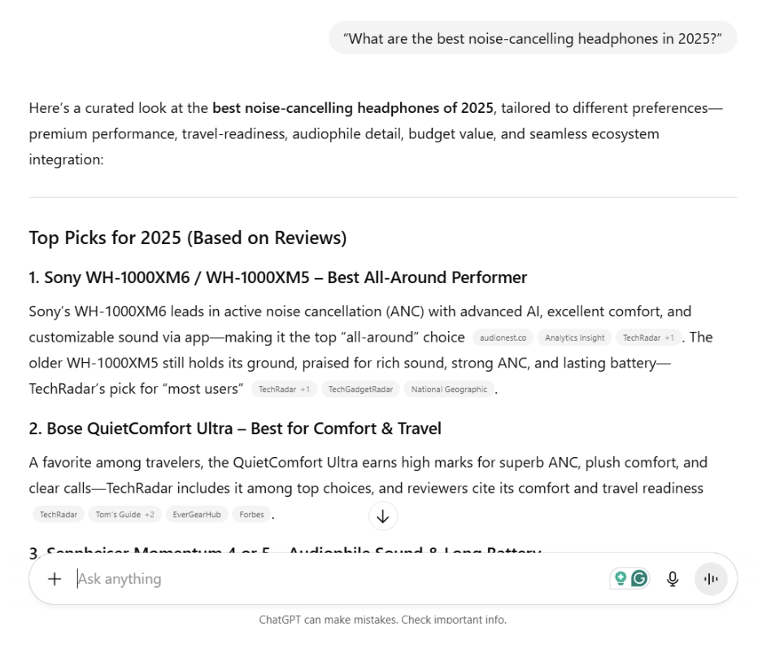
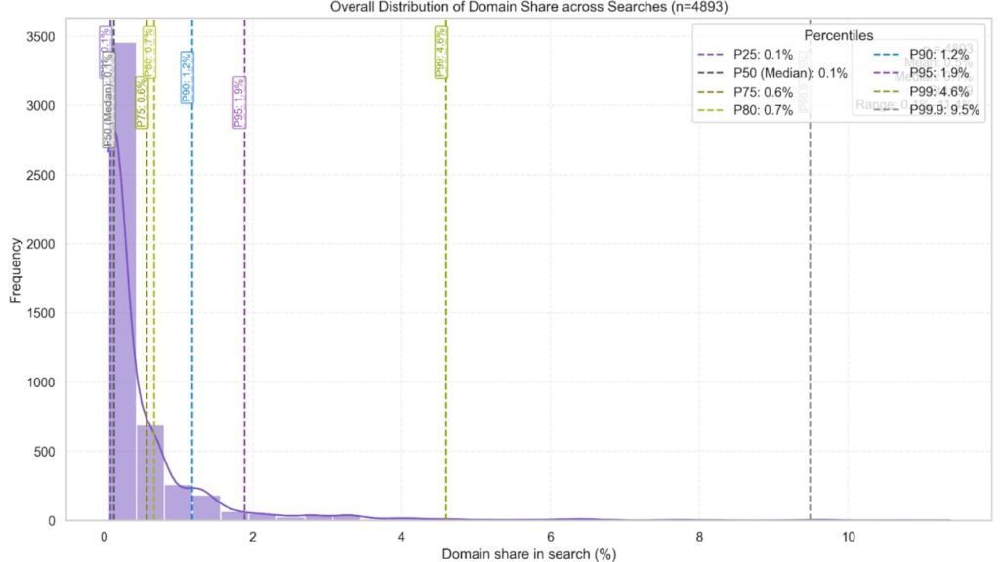
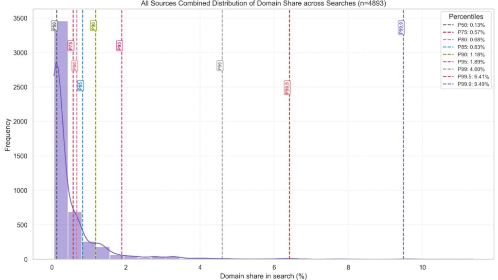
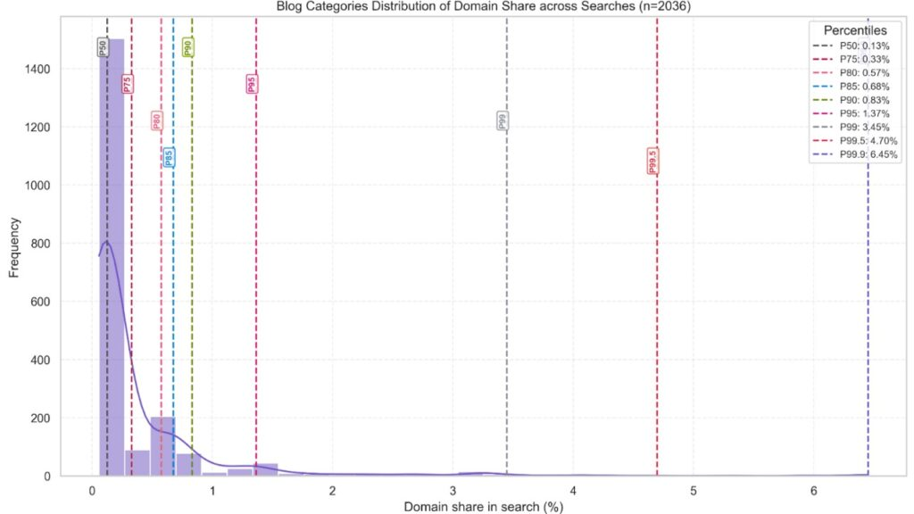
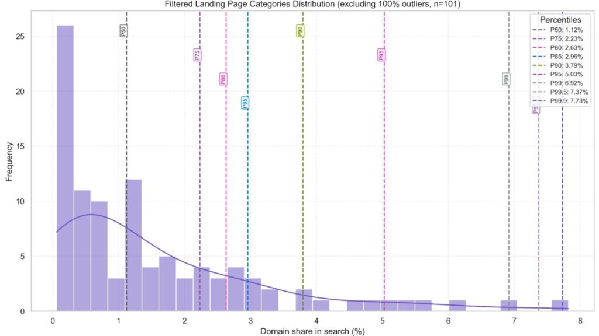

# Source Mention Benchmark 2025- Are You Winning the AI Search Visibility Race?

###### Isha Sachdeva

Founder, visble.ai

Online visibility isn’t just about ranking **#1** for keywords in 2025.

The real winners in AI-driven search are the brands & websites that consistently appear across multiple queries as well as sources. These are the new benchmarks for measuring visibility in an AI search world.

Think of it like networking. Even if you’re not the keynote speaker, showing up at every event keeps your name top-of-mind.

Source Mention works the same way. Being consistently cited or mentioned builds credibility & authority.

The question is- Are you barely visible, lost in the crowd, or breaking into the top percentiles?

## What are the Primary Measurable Outcomes of AI Search Visibility?

There are two primary [measurable outcomes](https://docs.google.com/document/d/1967e_s-mnXN2bJxqdg5o0p4gsDgbrLyGirrWwxdbQ8s/edit?usp=sharing) that tell you how well your brand and the website are performing in AI search.

### Search Visibility in Responses

How frequently your brand or website appears in answers provided by AI is all about response search visibility. Instead of links on a page, it’s about being part of the actual response the user sees. Your visibility will increase, corresponding to the frequency of your appearances.

### Citation/Source Mention

When you are cited as a reliable source in the LLM’s response, that means you have a source mention. AI models highlight or cite your web page when they consider your content credible. These mentions serve as authority signals and help you gain more visitors to your web page.

## What is Source Mention in AI Search Engines?

 

Source Mention measures how often your website, brand, or content is cited across AI search responses.

<figure>

<figcaption>

This image shows how a source mention appears

</figcaption>

</figure>

Different websites credited under the answer are referred to as sources or citations.

Source mention is an AI search visibility metric that depicts how often your website or other websites are being mentioned as a source in the response text.

Having a high source mention helps you boost both trust, brand visibility, and traffic on the mentioned web page.

Why does it matter? Even if you never rank #1 for a search term, frequent mentions signal trustworthiness along with relevance. Search engines & AI discovery systems notice patterns of repeated citation.

Being mentioned often is like showing up at every networking event. You may not lead the stage, but your face is remembered, so opportunities start coming your way.

## Who’s Winning the Visibility Game?

This benchmark isn’t just theory; it’s backed by real data. Our experiment analyzed 2,036 domain-search combinations, drawing from a database of over 13,000 URLs across industries.

The goal was simple: to measure how often brands are being cited as sources in AI search results, and what that reveals about true digital visibility.

The data shows a clear pattern:

- Wikipedia is the leading source, appearing in 79% of campaigns.
- Reddit follows, showing up in 41% of campaigns.
- Most other brands are still struggling to achieve consistent visibility or break through in source mentions.

The distribution is heavily skewed, which means a small percentage of domains capture the majority of visibility, while the median brand remains nearly invisible.

What we’re establishing here is not just who gets mentioned, but how visibility in AI search is distributed, and what percentile your brand needs to reach to move from the crowd into the authority tier.

## A Look at Overall Domain Share

To understand who’s truly visible in AI search, we analyzed overall domain share. It measures the frequency with which brands are mentioned across all types of sources. This benchmark provides a clear, percentile-based view of where most websites stand in the AI visibility race.

Why does this matter? Because averages alone don’t tell the full story. A brand that appears once in a while might look “present,” but percentile-based benchmarks reveal whether you’re truly shaping perception or just blending into the background.

Our analysis reveals that the majority of brands remain at the lower percentiles, with visibility that barely moves the needle. Only those breaking into the higher tiers- P90, P95, etc- manage to consistently influence how AI answers user queries.

## What are Source Mention Percentiles?

Percentiles (P) give us a clearer picture of visibility distribution. Instead of just saying a brand is “visible,” we measure how it compares against thousands of other sources in AI search responses.

For example, sources in the Top 50 percentile (P50) represent the bottom half of all mentions, which means they are present but barely noticeable.

As you move higher up the percentiles, visibility becomes both rarer & more impactful.

**P50 (≈0.1%)- Barely Visible**

Roughly half of all sources sit here. These sites are mentioned occasionally, but their presence is so minimal that they resemble being on page 10 of Google, technically present, but irrelevant to users.

**P75-80 (≈0.6-0.7%)- Gaining Traction**

Sources in this bracket appear more consistently, but still blend into the crowd. They’re visible enough to register, but not yet influential.

**P95+ (≈1.9% & above)- Authority Builders**

Crossing into this range signals that your brand is being cited repeatedly. At this stage, you’re shaping perception, not just showing up.

**P99 (≈4.6% & above)- Market Leaders**

These brands are part of the elite circle. Their consistent citations make them leaders who influence AI responses across categories.

**P99.5+ (≈9% & above)-The Exceptions**

This tier is almost untouchable. It’s dominated by social platforms, Wikipedia, and major news websites, the kinds of sources AI models consistently prioritize for credibility.

**Takeaway**

If your brand is below P75, your visibility is inconsistent. To truly compete, you need to push toward P95 & beyond, where mentions become perception-shaping.

Breaking into P99+ is rare, but reaching P95 already places you among the most authoritative players in AI search.

Looking at all sources together provides a holistic view of your brand’s accurate visibility.

The median domain share sits at 0.13%. This means that most brands barely make a mark across the search landscape. Simply being present isn’t enough. Your content must consistently appear across multiple sources to gain recognition.

Breaking into P90 (1.18%) signals that your brand is beginning to influence searcher perception, while P99+ (4.6%- 9.49%) is reserved for the most authoritative, content-rich brands that dominate mentions across channels.

**Key Insight**

Averages can be misleading. While the median sits low, the real action happens at the very top. Over 90% of clicks are captured by domains in the 95th percentile & above, the sources that consistently earn mentions across AI search responses.

In other words, simply being “present” in the median range won’t drive meaningful traffic or influence. To compete, your brand needs to push into the P90+ range, where visibility starts translating into authority & clicks.

The higher you climb, the more AI trusts you, as well as the more searchers do too.

## Blog Categories Distribution

Analyzing domain share specifically within blog categories reveals how effectively your content is being recognized & cited within your niche.

**P50 (≈0.13%)- Nearly Invisible**

Half of all blogs sit here. They exist, but with minimal mentions. Their content rarely surfaces in AI search or influences readers.

**P75-80 (≈0.4–0.6%)- Gaining Traction**

Blogs in this range are appearing more often, but they’re still part of the noise rather than the signal.

**P90 (≈0.83%)- Authority Builders**

Crossing this level means your blog is starting to shape conversations in its category. Mentions are consistent, but not yet dominant.

**P99 (≈3.45% and above)- Leaders**

These blogs are frequently cited, highly influential, as well as directly guide discussions in their niche. They’re the go-to sources for AI engines.

**P99.5+ (≈6.45% and above)- The Exceptions**

This ultra-elite tier is mostly occupied by large editorial sites, Wikipedia pages, as well as highly trusted news-style blogs.

**Takeaway**

If you rely on blogs for visibility, aim to break into the P95+ range, where content consistently earns citations to influence both AI responses as well as reader perception.

## Landing Page Distribution

Landing pages often serve as the frontline of your brand’s online visibility. Unlike blogs, which build awareness gradually, landing pages are frequently cited & surfaced by search engines as well as AI discovery tools.

**P50 (≈1.12%)- Nearly Invisible**

Even at the median, landing pages outperform most blogs, but they’re still only lightly visible & rarely influential.

**P75–80 (≈2–3%)- Gaining Traction**

Pages in this range are surfacing more often across searches, but they remain interchangeable as well as not yet trusted as primary sources.

**P90 (≈3.79%)- Authority Builders**

Well-optimized landing pages consistently appear in AI responses, extending reach as well as beginning to shape category-level visibility.

**P99 (≈7% & above)- Leaders**

These landing pages dominate citations. They’re not just built for conversions; they’re repeatedly surfaced as authoritative answers.

**P99.5+ (≈7.73% and above)- The Exceptions**

This top tier is extremely rare, reserved for high-credibility sources like Wikipedia, social platforms & major news outlets.

## Benchmark Takeaways- Where Do You Stand?

| **Source Mention %** | **Overall** | **Blogs** | **Landing Pages** | **What It Means** |
| --- | --- | --- | --- | --- |
| **0.1%- 0.7%** | Low | Low | Low | Present but largely invisible. You show up occasionally, but not enough to make an impact. |
| **0.8%- 1.8%** | Moderate | Moderate | Moderate | Competitive presence. Gaining traction, but easily replaceable. Not yet authoritative. |
| **1.9%+** | High | High | High | Elite visibility. Consistently cited & recognized. Shaping perception as well as leading the category. |
| **4.6%+**  | Leaders | Leaders | Leaders | Market leaders. Frequently cited across queries, actively influencing AI responses. |
| **9%+** | Exceptions | Exceptions | Exceptions | Dominated by socials, Wikipedia, as well as major news sites. Extremely rare tier. |

**Audit your percentile today. Are you showing up or being remembered?**

## The Final Thoughts

Online visibility goes far beyond traditional SEO tactics in 2025. It’s no longer enough to rank for a few keywords. Brands must establish a consistent presence across multiple queries & sources.

Domain share has emerged as the key metric, reflecting how often your brand or content is cited or surfaced by search engines as well as AI tools.

Brands that focus on moving from sporadic mentions to top-percentile visibility not only increase traffic but also build lasting influence in their niche.

The competitive landscape is increasingly skewed toward those at the top, making percentile-based benchmarks essential for growth.

What’s Next? Audit your visibility percentile, identify gaps & set measurable goals to move from crowd-level mentions to consistently recognized visibility.
