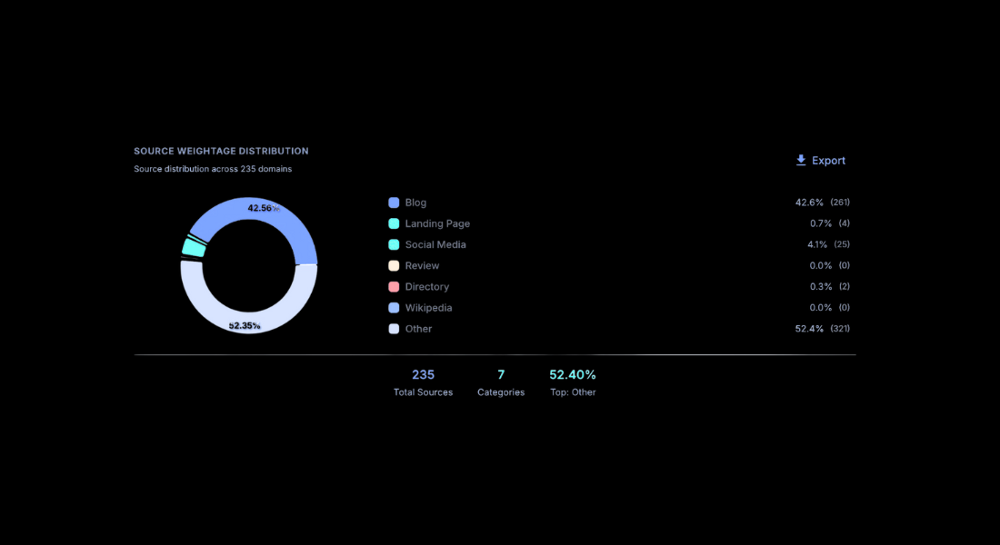
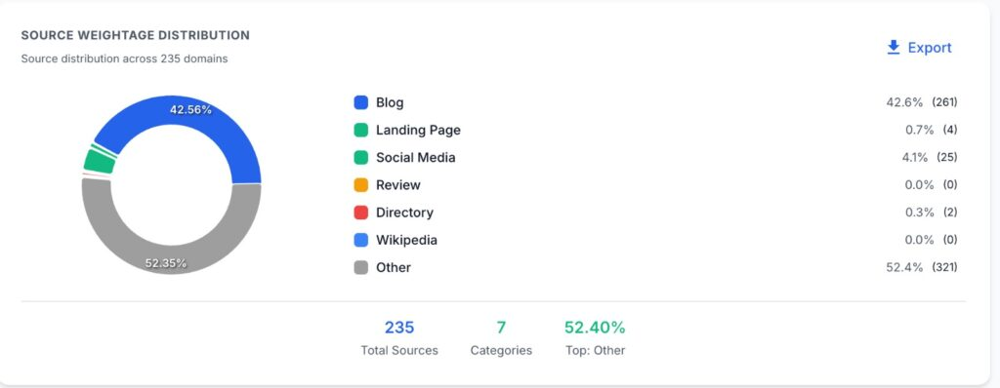

# Types of Sources in AI Search Response

###### Isha Sachdeva

Founder, visble.ai

The era of endless link-clicking is fading. In fact, studies show that over half of **[Google searches](https://www.bain.com/about/media-center/press-releases/20252/consumer-reliance-on-ai-search-results-signals-new-era-of-marketing--bain--company-about-80-of-search-users-rely-on-ai-summaries-at-least-40-of-the-time-on-traditional-search-engines-about-60-of-searches-now-end-without-the-user-progressing-to-a/)****,** a figure often cited as high as 60% now result in a zero-click" event. This means that users find their answer directly in the search results.

This highlights why curating the sources behind these AI summaries is critical for brands to maintain their digital presence. 

If you can understand what feeds the AI, you can optimise your content for a new outcome: AI Engine Optimisation (AEO), which runs alongside traditional Search Engine Optimisation (SEO).

AI search engines like AI Overview, ChatGPT, Gemini, and Perplexity, powered by [Large Language Models (LLMs)](https://visble.ai/blog/the-ultimate-llms-txt-guide/), don't just pick the top-ranking link. They issue multiple related searches across diverse subtopics and data sources to construct a comprehensive, synthesised answer.

Let's dive into the core sources these AI systems use and see how you can utilise them to enhance your brand visibility.

## Key Takeaways

- E-E-A-T for Authority: Long-form Blogs and Content Clusters are essential for establishing the deep topical authority that LLMs prioritise.
- Reviews Earn AI Trust: Third-party Review Sites and Directories function as the critical social proof layer, directly influencing AI-generated sentiment analysis.
- Data Structure Over Keyword Stuffing: Implementing Schema Markup (FAQ, Product) instantly boosts your content's "AI Answer Readiness Score" by making data extraction effortless.
- Landing Pages Drive AI Conversions: AI extracts transactional data (features, pricing, USPs) most effectively from highly structured Landing and Product Pages.
- The GSOV Metric: Brands tracking their Generative Share of Voice (GSOV) across these six source types see a faster increase in brand mentions in AI Overviews.

## What is the Role of Different Sources in AI Search

In AI search, the Large Language Model (LLM) reads, extracts, and compiles content from the web to create a valuable response to the user’s query. The sources listed below are the raw materials that AI uses.

|   **Source Type**   |   **Elements**   |   **AI Search Use**   |   **Relevance for AI Search**   |
| --- | --- | --- | --- |
|   Blogs    |   Online articles, journals, and expert opinions, often updated regularly.   |   Used for recent information, detailed guides, personal experience (E-E-A-T), and niche topics.   |   Medium to High (Depends on E-E-A-T and topical depth)   |
|   Landing Pages   |   Standalone web pages created to explain a product, service or value proposition.   |   Used for product details, service specifics, pricing, and business offerings.   |   High (Official company information)   |
|   Social Media   |   User-generated content from platforms like X (Twitter), Reddit, YouTube, TikTok, Facebook, and Instagram.   |   Used for real-time information, public opinion/sentiment, trends, and user-generated reviews/local discovery.   |   Medium to High (High volume, but variable reliability)   |
|   Review Sites   |   Platforms like Yelp, TripAdvisor, Google Business Profiles, and industry-specific review sites.   |   Used for local business information, aggregated opinions, and expert insights   |   High for Trustworthiness and Experience (E-E-A-T)   |
|   Directory Sites   |   Listings of businesses or organisations (e.g., Yellow Pages, industry-specific directories).   |   Used for basic business facts (Name, Address, Phone-NAP), hours, and categorisation.   |   Medium to High (Fundamental, foundational data)   |
|   Wikipedia    |   A massive, collaborative, and generally well-referenced encyclopedia.   |   Used for broad factual definitions, historical context, and consensus information.   |   High (Due to broad peer review/citation requirements)   |
|   News Sites   |   Current event reports, investigative journalism, syndicated news (e.g., AP, Reuters), and globally recognised publications.   |   Used for real-time relevance, verifiable facts on ongoing events, and establishing Authority and Trustworthiness (E-E-A-T) signals.   |   Medium (Acts as a trust signal for timely/factual queries).   |
|   Other   |   Academic papers, official government websites, e-commerce product pages, etc.   |   Used for authoritative, domain-specific, or primary source information.   |   Varies (Highest for official/scholarly sources)   |

## What are the Source Categories Used by AI to Generate Responses?

### **Blogs**

A blog post by an industry expert (with Expertise and Authoritiveness) is highly valued by AI models. A recent [analysis by McKinsey](https://www.mckinsey.com/capabilities/growth-marketing-and-sales/our-insights/new-front-door-to-the-internet-winning-in-the-age-of-ai-search) of the shift in digital marketing and consumer discovery due to LLMs found that the era of AI search significantly sidelines proprietary content. 

The report suggests that a brand's own website and content (including blog pages) typically make up only 5-10% of the total sources referenced by AI models, which instead draw from a diverse ecosystem including affiliates and user-generated content.

Having a well-structured and informative blog is important. They are often the best place to provide detailed, long-form answers that an AI can easily extract as a summary. It increases the probability of your content being cited.

### **Landing Pages** 

Landing pages provide specific, transactional information to AI-driven search engines. When users ask, "What is the price of X product?" or "What features are included in Y service?" It’s easy to generate an answer from these pages.

Ensuring your landing pages have a clear value proposition, concise headings and properly marked-up data (like product schema and FAQs) helps the AI extract this commercial information accurately.

### **Social Media (UGC)** 

Social media as a source includes User-Generated Content (UGC). AI models search platforms like YouTube, Instagram, and Reddit. In fact, Reddit outranks financial experts 176% of the time when ChatGPT answers finance questions. 

This helps AI get real-world experience, current public sentiment, and local discoveries. For example, an AI might use a [Reddit thread to understand](https://visble.ai/blog/source-mention-benchmark-2025/) a common problem with a product or an Instagram reel to find an affordable cafe. YouTube is especially considered for procedural "how-to" information.

Authentic community engagement is key. AI sees these peer-to-peer conversations as real-world, relevant knowledge. 

Optimising your social profiles and encouraging genuine reviews/discussions becomes a strong signal to the AI about your brand's real-world relevance and reputation.

### **Review Sites** 

Review sites incorporate aggregated platforms for customer feedback and ratings. Google Business Profile, Trustpilot, or Amazon are some of the review sites.

Skimming through reviews, AI models evaluate your brand’s Trustworthiness and Experience. It summarises the overall sentiment or extracts specific common themes from a large volume of reviews to include in a response.

When you go to the review section of Amazon, you must have seen a short paragraph summarising customer feedback before product images and written reviews. That’s also done by AI (e.g., "The fabric is appreciated for the quality, but some users find it overpriced").

[Managing your online reputation](https://visble.ai/) on these platforms is highly recommended. AI uses them to ground its sentiment and quality checks.

### **Directory Sites**

Websites that list businesses, organisations or people, often categorised by location or industry. Directory sites are like a digital phone book.

Directories are vital for validating Non-Contradictory Fact Checks, especially for local businesses. The AI checks these sites to confirm the business's NAP (Name, Address, Phone), operating hours, and primary services.

Consistent and accurate listings across major directories make AI search engines trust you.

### **Wikipedia**

Wikipedia is a free, online encyclopedia written and maintained by a community of volunteers.

A research study analysed how AI search compares to traditional Google rankings. The study used ChatGPT and the Google AI Model for analysis. Prompts were tested across five major industries. These industries were finance, digital technology, business services, consumer electronics, and fashion. 

The findings are clear: Wikipedia is highly prominent. It was cited as the number one or two source in almost every industry reviewed.

This has led to an [8% drop in human pageviews](https://www.livemint.com/technology/tech-news/wikipedia-loses-8-of-human-traffic-as-generative-ai-and-social-platforms-change-user-habits-11760848337091.html) for Wikipedia. It reflects AI's growing ability to directly answer questions based on its training data, which often includes Wikipedia content.  

Wikipedia provides broad, introductory, and factual consensus information. Its content is highly structured and mostly well-cited, making it easy for AI models to process and rely on for definitions and facts.

While you can't optimise your own site on Wikipedia, being cited by Wikipedia (or having your main entities mentioned there) is a strong authority signal that the AI will recognise.

### **News and Major Media Outlets**

A News and Major Media Outlet refers to a website or digital section dedicated to reporting current events, journalistic investigations, and expert commentary on a wide range of topics, from global politics to market trends. 

The source reflects Trustworthiness and Authoritativeness (E-E-A-T). AI search engines rely on it for real-time relevance and verifiable facts concerning ongoing events. 

Major, globally recognised publications (like The New York Times or Reuters) are consistently among the top-cited domains. 

Being cited acts as a super-charged backlink of trust for AI, significantly boosting your overall digital authority and increasing the probability of your content being chosen by LLMs. This is significant for queries seeking immediate, factual updates.

### **Other Sources (Scholarly, E-commerce, etc.)** 

This includes everything else that’s left. You can consider highly authoritative domains such as government or educational sites (.gov, .edu), academic journals, and product pages on large e-commerce sites.

AI crawls:

- Scholarly/Official sources for data, statistics, and highly authoritative/verified facts. It reflects Expertise and Authoritativeness.
- E-commerce for specific product configurations, models, and comparisons.

If your business is featured in a news article or referenced in a scholarly paper, this provides one of the strongest "Trustworthiness" signals to the AI.

## How to Track Source Categories with Visble.ai?

Tracking and monitoring top source categories is essential for AEO. [Visble.ai](http://visble.ai), a specialised AI analytics tool, excels at tracking brand citations and domain authority within Generative AI responses.

#### **How it works:**

1. **Campaign Creation:** The platform allows you to create a campaign using a large volume of prompts and queries related to your target keywords and core topics.
2. **Source Curation:** [Visble.ai](http://visble.ai)’s algorithm curates an exhaustive list of all the external web sources and domains cited by AI Search Engines (like Google's AI Overviews, or LLMs like Gemini and ChatGPT) to answer those queries.
3. **Categorisation & Analysis:** The tool then systematically organises these cited domains into their respective Source Categories (e.g., News, Blog, Directory, Forum, Research). This generates a quantifiable report showing the percentage of involvement for each source category.

With this data, you can clearly see which type of content is most highly valued by AI models for your specific topics. This allows you to strategically focus your content creation efforts on the most appearing source category, directly enhancing your brand’s visibility and citation probability across LLMs.

## Conclusion

Since AI has become a common tool for generating content, you will find a lot of AI-generated content published on the internet. AI-generated content may [have some misinformation](https://en.wikipedia.org/wiki/Wikipedia:Reliable_sources/Perennial_sources#Large_language_models) if not responsibly rectified by an industry expert. 

This is where your brand can stand out. Create original and unique content. Provide information, guidance, and advice as an expert for humans, while following the strategies to make AI models like you.

You don’t need to target every source for brand visibility. You have to figure out which sources work best for your business and what metrics to focus on to enhance your Generative Share of Voice.
