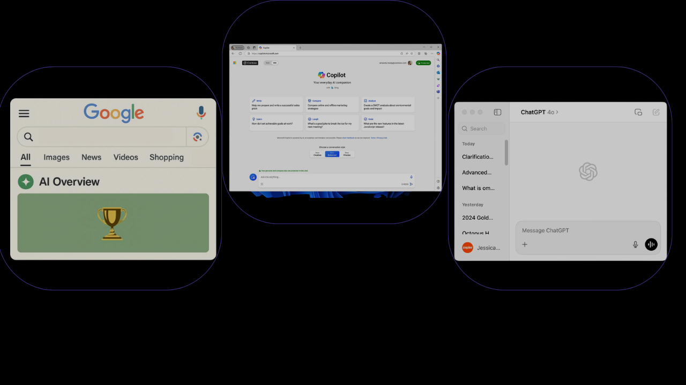
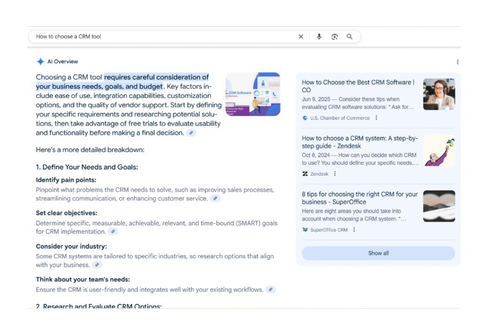
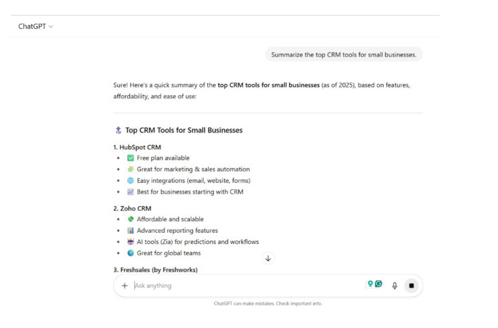
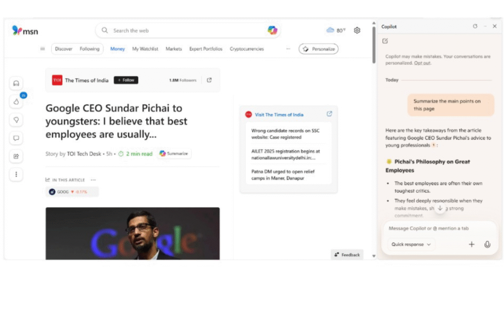

# What Do Google's SGE, Bing CoPilot & ChatGPT Have in Common?

###### Isha Sachdeva

Founder, visble.ai

Have you noticed how search engines anticipate your needs more accurately? The emergence of AI tools like Google’s SGE (Search Generative Experience), Bing CoPilot & ChatGPT is rapidly transforming the way we discover as well as consume information online. 

Approximately 15 million people in the U.S. used generative AI as their primary tool for online search in 2024. The figure is projected to reach [36 million, more than double by 2028](https://www.statista.com/statistics/1454204/united-states-generative-ai-primary-usage-online-search/).

That’s not merely a shift. It represents a fundamental transformation. The global search market stands at the forefront of transformation as AI revolutionizes our methods of discovery as well as interaction with information. 

What shared characteristics exist among these AI giants? Why is it essential for you to take note? Let’s take a look at this in detail.

## Search Bars to Smart Answers- The Rise of AI Summarization

AI tools such as Google SGE, Bing CoPilot & ChatGPT are transforming information retrieval & comprehension.

|   **Google SGE**   |   **Bing CoPilot**   |   **ChatGPT**   |
| --- | --- | --- |
|   - Integrates AI-generated responses directly into the search interface.  - It provides instant answers without requiring additional navigation.   |   - It is integrated within Microsoft Edge. - Summarizes web pages & compares data. - Enhances search experience in real-time.   |   - It serves as a comprehensive assistant. - Answers queries, summarizes documents. - Even generates content effectively.   |

It’s noteworthy that an increasing share of searches on Google are now resulting in SGE summaries, with more than one-third of Gen Z users opting for ChatGPT over traditional search engines.

Today, relying solely on traditional SEO is insufficient. It is essential to create content that is structured & credible for human readers as well as AI engines.

## What These Tools Have in Common- A Quick Look

What connects Google SGE, Bing CoPilot & ChatGPT? These tools are connected by one primary objective, regardless of their different setup. Enhancing the speed & accessibility of information!

Let us analyze the key traits they share that are transforming our methods of searching & engaging online.

### They Prioritize Clarity & Structure

AI tools prefer clarity! Both Google SGE & ChatGPT prioritize content that is well-structured & easy to digest.

Consider using

- Clear headings
- Bullet points
- Consistent format

OpenAI’s guidelines also favor concise, well-structured information. The proper structure is vital to ensure visibility in AI-generated answers.

### They Extract from Consensus Sources

AI tools depend on consensus sources rather than pulling information from anywhere. They are trained to surface answers that reflect what multiple trusted sources agree on. 

Google SGE frequently aggregates information from various sources simultaneously to emphasise current trends, rather than relying on a single perspective. 

Similarly, ChatGPT tends to cite information from high-authority domains like major publications or top-ranking pages. 

Studies show that content from domains with a [Domain Authority (DA) of 80-100 made up over 31% of AI citations](https://www.xfunnel.ai/blog/what-sources-do-ai-search-engines-choose), whereas content from domains with a DA below 20 was rarely mentioned.

This demonstrates the importance of trust & consistency when it comes to AI content selection.

### They Deprioritize Thin, Keyword-Stuffed Pages

AI tools like Google SGE and ChatGPT now deprioritize thin, keyword-stuffed content. Instead, they favour pages that offer real value while being rich in context.

The focus has shifted from keyword frequency to the depth & clarity of topic explanation.

Google’s documentation on the Helpful Content Update emphasizes this transition. It encourages creators to focus on content written for people rather than algorithms.

Pages lacking depth or meaningful value are increasingly overlooked by AI summaries!

### They Pull Structured Data & Semantic Pattern

AI tools love structured data as it enhances their ability to comprehend & present information with clarity.

Utilizing these formats makes it easier for AI to extract essential information.

- JSON-LD
- Schema.org markup
- FAQ sections

Content that is structured in tables or step-by-step formats is highly preferred. This is because it is scannable as well as easy to cite.

The significance of semantic signals, representing the relationships between concepts, matters more than just exact-match keywords. AI summary & search results are much more likely to feature content that is well-structured, as well as includes helpful markup.

### They Surface Multi-Format Content with Summarizable Elements

Google SGE & ChatGPT prefer multi-format content that’s easy to summarize. Incorporating charts or infographics into your blog significantly increases your chance of being picked up if you describe them well. 

These tools often extract information from alt-text or video descriptions to understand as well as represent your content accurately. Let's consider an example. A YouTube video with a clear description below it is far more AI-friendly than a raw embed with no context.

### They Prioritize Content That Matches User Intent

AI tools prioritize whether your content truly matches user intent over exact-match keywords in content. 

Rather than focusing solely on a generic phrase such as best productivity tools, it is more effective to prioritize content that addresses user-driven queries, like what tools assist remote teams in managing their time more effectively?

These tools assess various intent types (informational, navigational, or transactional) to favor content that is meticulously structured to align with those specific purposes.

Use Google’s ‘People Also Ask’ or autocomplete suggestions to craft content that reflects how people ask questions.

### They Prefer Decentralized Content Blocks

ChatGPT & Google SGE prefer decentralized content blocks instead of long paragraphs.

This includes formats like:

- Mini guides
- FAQs
- Titled sections within a larger article

These blocks facilitate more efficient scanning, extraction, and accurate summarization by AI engines. When each section is capable of independently addressing a specific question or sub-topic, you have achieved a significant advantage.

Include a summary at the beginning of each section. This approach not only benefits the reader but also enhances your likelihood of being featured in AI results.

## How AI Summaries Get Built (with Examples)?

### Google SGE Summary Breakdown

Let's take a look at the query- how to choose a CRM tool. SGE typically pulls bullet points or bolded highlights from multiple high-authority pages. 

You'll often see short paragraphs with bold keywords like ease of use or integration options.   
  
What’s interesting is that SGE cites multiple sources inline. The better your content is structured, the more likely it is to get featured.

### ChatGPT Answer Sourcing

ChatGPT scans multiple trusted blogs & articles, then combines the key points into a single response. It prefers content that's formatted because it makes it easier to extract useful information & present it helpfully. 

### Bing CoPilot’s Contextual Layer

Bing CoPilot adds a contextual layer by analyzing the surrounding content on a website.

Therefore, whether you're reading a product page or blog post in Microsoft Edge, CoPilot can smartly gather relevant information from other parts of the site or even connect it to broader topics. 

CoPilot often aggregates insights in the sidebar while Google's SGE focuses on summarizing the query. It’s like having a mini researcher alongside you, pulling in just the proper context as you browse.

## What Does This Mean for Your Content Strategy?

|   **Optimize for AI summaries, not just human readers**   |   Write like you’re answering a question. Give the clear answer first, then go deeper.   |
| --- | --- |
|   **Write like you’re guiding someone step by step**   |   Think like an explainer! Use headers like “what is”, “steps to”, or “benefits of”. Keep definitions short as well as to the point.   |
|   **Use schema & semantic markup**   |   Add structured data like FAQPage or HowTo. This helps AI tools better understand & summarize your content in context.   |
|   **Don’t over-rely on keyword matching**   |   Use related terms, semantic variations & language that aligns with user intent.   |
|   **Create citable moments**   |   Highlight stats or definitions. AI pulls these into summaries, so make them stand out visually & structurally.   |

## The Final Thoughts

Today, search is becoming more like a conversation & tools like Google's SGE, Bing CoPilot & ChatGPT are at the forefront of this shift. They differ in how they present & pull information. But they all share a clear goal to deliver fast & helpful answers. That means the old rules of SEO aren’t enough anymore. 

Your content now needs to be structured & aligned with real user intent. The future of visibility lies in being understood by both humans & machines. So what’s next? Start creating content that is ready for AI to find & feature.
